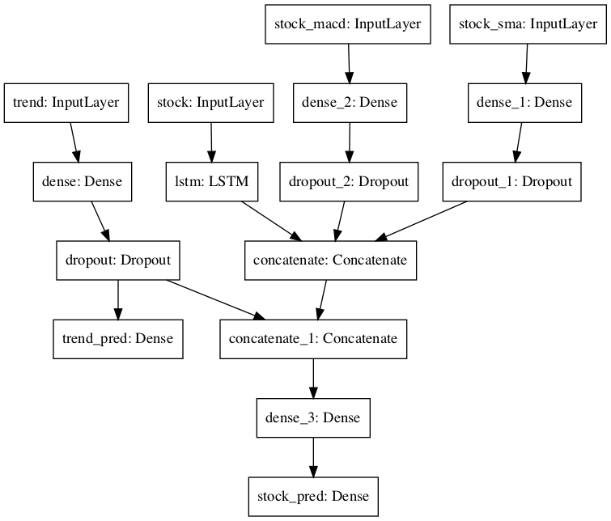
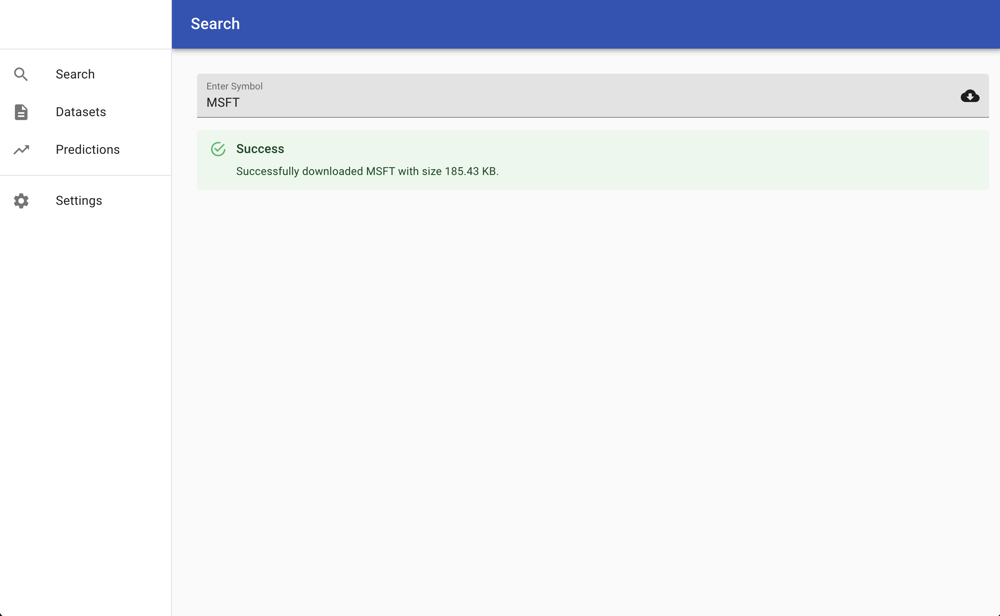
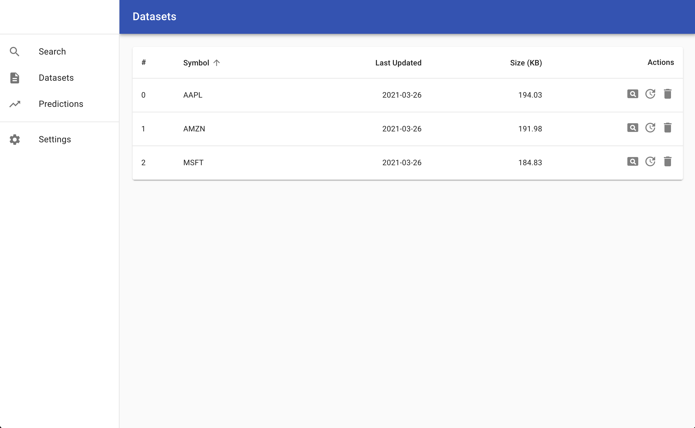
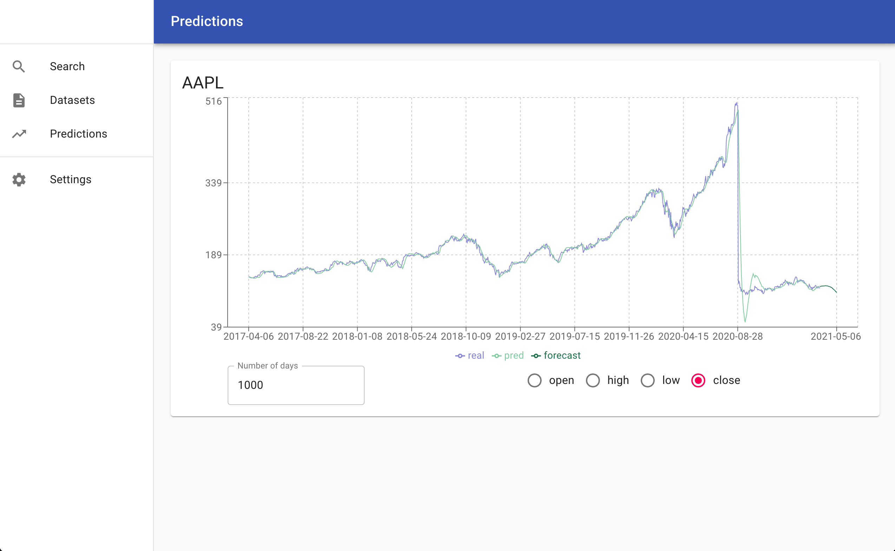

# SMP

A project trying to generate stock marker predictions using a combination of technical indicators and google trends to explain some of the up and downs. This project is made for educational purposes only and still needs lots of refinements over the predictor model.

To visualize the model, there is a frontend UI made with `Electron` and `React`. The prediction and data logic is done with `python` and `tensorflow`.

# Table of contents

-   [SMP](#smp)
-   [Table of contents](#table-of-contents)
-   [Requirements](#requirements)
-   [Model Overview](#model-overview)
-   [Running Application](#running-application)
    -   [Frontend](#frontend)
    -   [Backend](#backend)
    -   [VSCode](#vscode)
    -   [App images](#app-images)
-   [Building and Packaging](#building-and-packaging)

# Requirements

-   Frontend
    -   Node v14.15.x
    -   Yarn v1.22.x.
    -   Install libraries using `yarn install`
-   Backend
    -   Python 3.7
    -   Tensorflow 2.0.0 or greater
    -   The following packages corresponding to python 3.7:
        -   sklearn
        -   numpy
        -   flask
        -   alpha_vantange (wrapper)
        -   pytrends
        -   pandas

NOTE: Everything except `alpha_vantage` is available through anaconda's conda-force channel. `alpha_vantage` is available through `pip`.

# Model Overview

Right now the model goes through one input layer of google trends, one layer of the stock data and two layers, sma(simple moving average) and macd(moving average convergence divergence) to train the model.

The training phase will go through 5 epochs with batch size of 32.

# Running Application

## Frontend

1. `yarn install`
2. `yarn start`
3. After backend server starts, go to settings and add alpha_vantage `API_KEY`. [Click here](https://www.alphavantage.co/) to get an `API_KEY`.

## Backend

1. Move `config_example.ini` to `config.ini`.
2. Activate virtual environment if any.
3. Make sure to add `backend` directory to `python path`. (IMPORTANT)
4. `python backend/server.py`

The UI will need the backend to be running in order to fetch datasets and do predictions.

## VSCode

There are launch and task scripts made for `vscode`.

Start by running the `server`, then either `Electron:Main` to just run instance of Electron (can debug only main process) or `Electron:all` which can debug the frontend ui as well.

## App images

# Building and Packaging

Coming soon.
